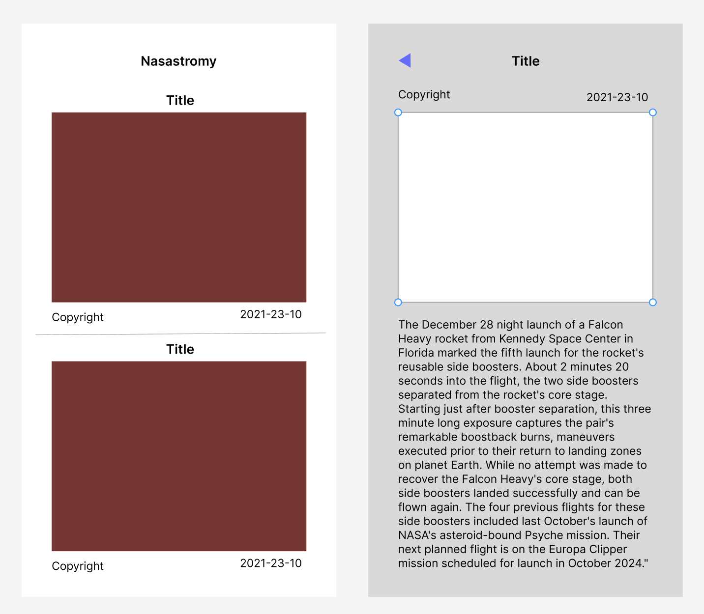
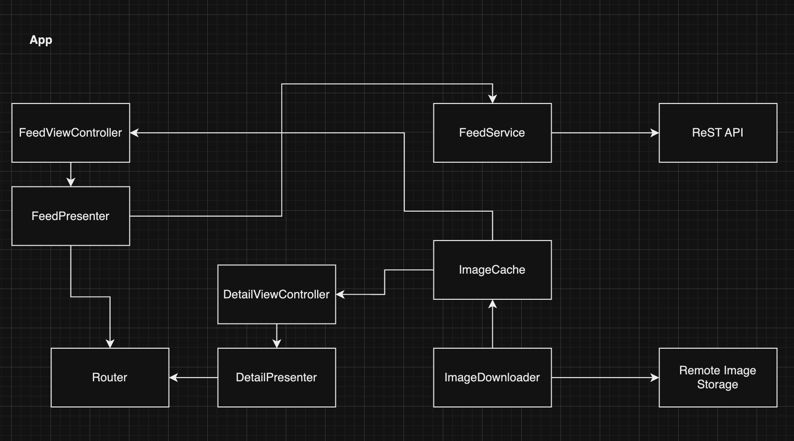
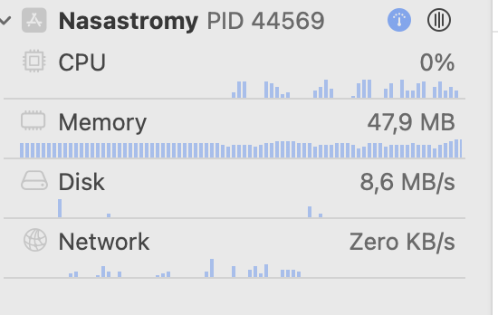
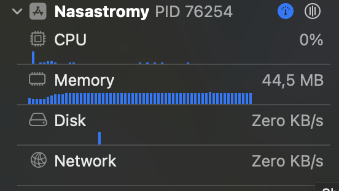

## Nasastromy

#### Starting with home test documents, I try to summarize what I should do and create a mini document about that. The main point is
- List of images with title, image, and date taken
- Detail page with image and description
- Contain a list of images from the last 7 days

#### From that, I made an initial analysis
- Will only have 7 images, so no infinite scrolling
- It will be a pretty small app, so I choose simple MVP UI Architecture, but adding a router to navigate cleaner
- Since it has few images, I thought caching images would be better
- After exploring the sample API response, it looks like some object contains additional key-value, but mostly the same
- Code should be testable so, considering mocking via dependency injection

#### To better visualize the requirements, I made a mockup and diagram

---

#### After the main page is developed
I tried to look at the debug navigator and saw CPU and Network usage is pretty high, then I applied the image caching strategy for downloaded images, and it really helped. Also, make sure the image download is on a background thread and applied asynchronously on the main thread. Not to forget make URLRequest use cache, since API response will return consistent data for every URL.

|  before                         | after                           |
|---------------------------------|---------------------------------|
|  |   |

#### Unit Test
I added as many tests as needed. The fun part of the test was when I tried to mock URLSession to test network calls, I found out it is better to play through URL Loading System via subclassing URLProtocol, it's new to me.

#### Scalability of table view
In the end, I thought the FeedView could have a few other types, e.g. a video post, so I made it easy to add a new cell type by making an abstraction for the table view cell.

#### Here's the app preview
- https://github.com/ahikmatf/Nasastromy/blob/main/img/app-preview.mp4
